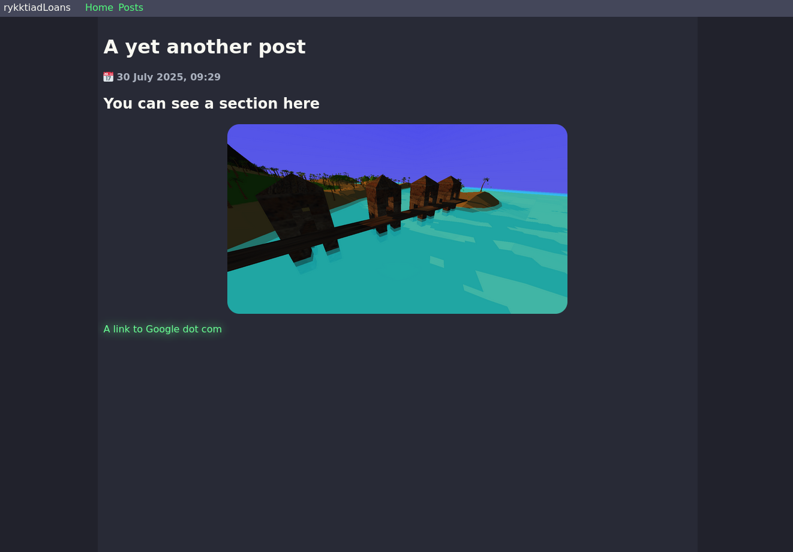
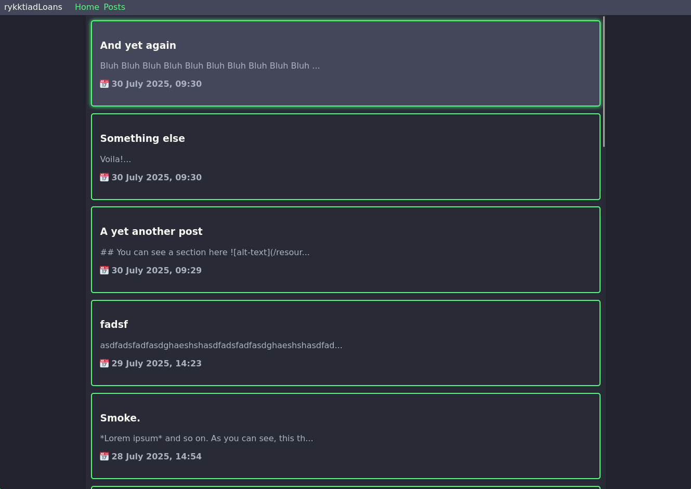
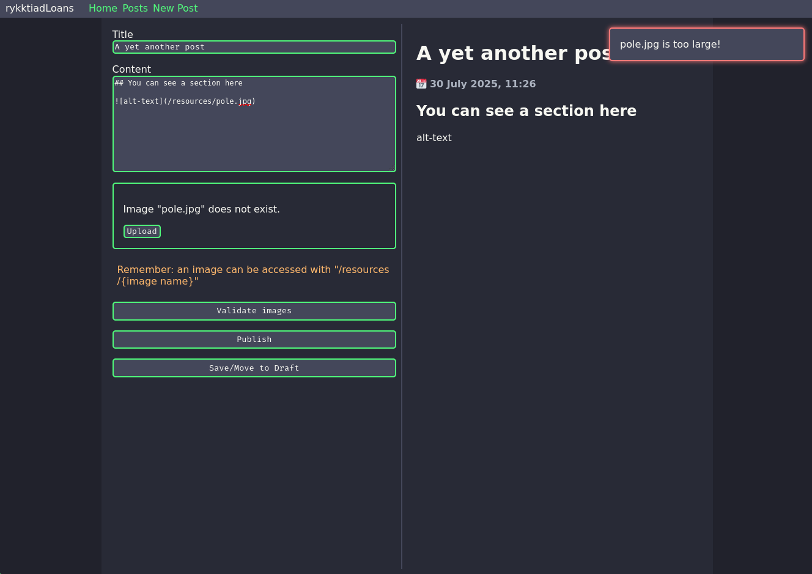
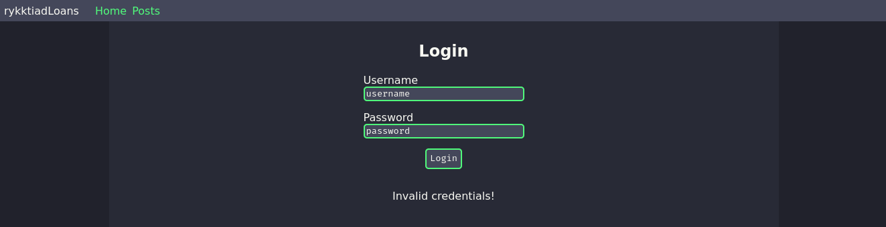

# Spring-based Blog Application

This is a repository for a personal text multiservice-based blog application made with Spring Boot and Vue. PostgreSQL is used for persistent storage.

The application consists of 4 microsevrices, not counting a database container. And they are:
- API service: exposes an API for working with the database entities, such as posts and resources, as well as saving images to the persistent storage.
- Auth service: responsible for user authorization, as well as generation and validation of JWT tokens.
- Frontend service: service responsible for returning proper HTML-based frontend to the client.
> **_NOTE:_** To be able to log in as the page owner, the user has to manually navigate to `/owner/login`. Every other page a user should be able to reach can be easily accessed otherwise.
- Gateway: Spring Cloud Gateway-based application gateway that reroutes request to their proper destination, as well as filtering out unauthorized requests using Auth service. Implements HTTPS.

## Features
- Owner can write and publish posts using Markdown syntax.
- Owner can upload new images for the posts ad-hoc.
- Owner can also save images to drafts.
- Any published post can be viewed by any user.

## Screenshots

## Running it

### Docker Compose Dev Build
This application can be built and run locally using Docker Compose with `compose.yaml`.

Docker containers for specific microservices are also publicly available in the *Packages* section.

In order for the Docker Compose to run, the following environmental variables need to be set.

| Environmental Variable | Example Value                                              | Purpose                                                        |
|------------------------|------------------------------------------------------------|----------------------------------------------------------------|
| DB_NAME                | `postgres`                                                 | Name of the PostreSQL database                                 |
| DB_USER                | `admin`                                                    | Database username                                              |
| DB_PASSWORD            | `generic-password`                                         | Password for the database user                                 |
| DB_URL                 | `jdbc:postgresql://database:5432/blog`                     | URL of the database with extra info for JDBC                   |
| OWNER_NAME             | `Owner`                                                    | Name of the page owner (yourself). Needed for logging in       |
| OWNER_PASSWORD         | `password-generic`                                         | Password the the owner account                                 |
| JWT_SECRET             | `SomeReallyLongPhraseForSecurityReasonsLikeReallyDamnLong` | Secret phrase used for generating JWT tokens. Needs to be long |
| JWT_EXPIRATION         | `86400000`                                                 | An amount of time a JWT token is valid in milliseconds         |
| KEY_STORE              | `/app/certificate/keystore.p12`                            | Key store for HTTPS                                            |
| KEY_PASSWORD           | `keystore-password`                                        | Password to the keystore                                       |
| KEY_ALIAS              | `certification`                                            | Key store alias                                                |
| LOGGING_LEVEL          | `DEBUG`                                                    | Logging level of all applications                              | 
| DEVTOOLS               | `true`                                                     | Turn on reload on file change for all applications             |

## API Reference

OpenAPI reference can be obtained from a server at `/api/v1/swagger-ui`.

## To-do list
- [x] Ability to post images
- [x] Add centralized exception handlers
- [x] Implement draft support
- [x] Add proper image support
- [x] Image presence verification
- [x] Add proper pagination to Vue
- [x] Refactor Vue a bit
- [x] Proper structuring
- [x] Add Javadoc
- [x] Proper constraints
- [x] Add ResourceResponse
- [x] Refactor other stuff
- [x] Add tests
- [x] Added basic CI script
- [x] Remove HTTPS from gateway and replace it with NGINX
- [x] Add Kubernetes config
- [x] Add the ability to set logging level and live reload with env variables.
- [x] Add Error page
- [x] Add Valkey caching
- [x] Add rate limiter (Using NGINX ingress)
- [x] Fix Vue duplicating requests
- [x] Proper styling
- [x] Add some actual content on the home page
- [x] Add notification system to frontend
- [x] Add RSS
- [x] Add JSDoc
- [x] Figure out how to do actuators
- [x] Add OpenAPI
- [ ] Refix the "Not Found" issue
- [ ] Try deploying it somewhere
- [ ] Add more tests
- [ ] Add summaries to posts
- [ ] Add general purpose file storage system
- [ ] Add post comment section
